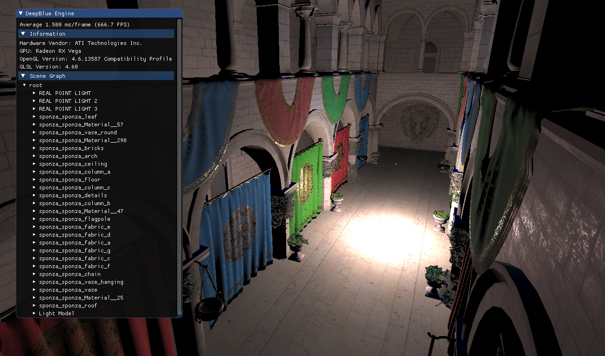
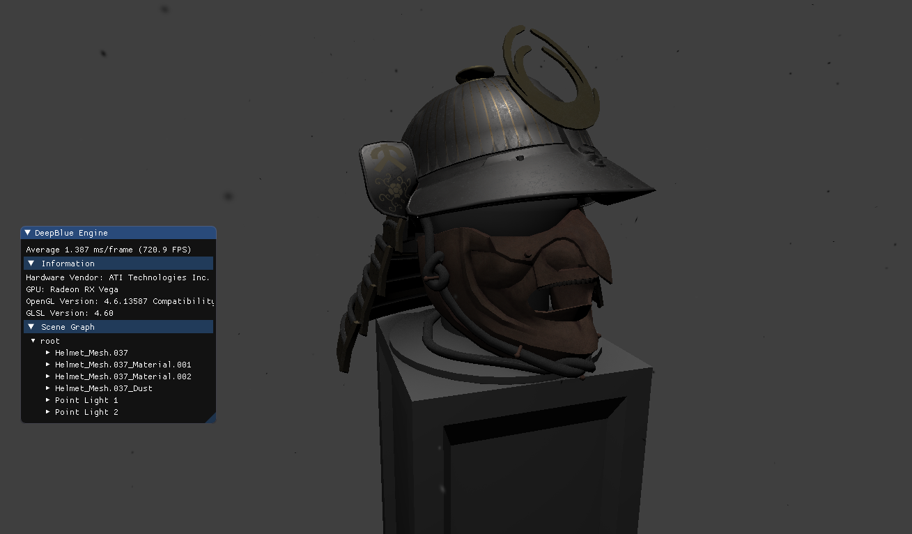

# Deep Blue Rendering Engine
A small rendering engine written in C++ using OpenGL.

## Table of Contents

* [About the Project](#about-the-project)
  * [Built With](#built-with)
* [Getting Started](#getting-started)
  * [Prerequisites](#prerequisites)
  * [Installation](#installation)
* [Usage](#usage)
* [Examples](#examples)
* [License](#license)

## About The Project

This small rendering engine was written as a side project to experiment with more complex systems and computer graphics in general. I kept on adding things as I needed them, beginning at just rendering a triangle and gradually adding to it.

Current features:
* Custom .OBJ loader
* Forward rendering
* Point Lights
* Physically-based rendering pipeline
* GUI
* Entity-component-system
* Scene graph

### Built With

* [GLFW](https://www.glfw.org/) - Window creation, context and event handling
* [GLAD](https://github.com/Dav1dde/glad) - OpenGL loading library generator
* [ImGUI](https://github.com/ocornut/imgui) - GUI library
* [SpdLog](https://github.com/gabime/spdlog) - Logging library


## Getting Started

You can either download the source code and experiment yourself, or alternatively download a precompiled scene [here](https://github.com/BenCKB/DeepBlue/releases).

### Prerequist
 Currently, only Windows is supported. You will need [Visual Studio](https://visualstudio.microsoft.com/) to open and compile the project solution.  

### Installation

1. Get the source code

    * Clone
        ```sh
        git clone https://github.com/BenCKB/DeepBlue.git
        ```

    * or zip download
      ```sh
      https://github.com/BenCKB/DeepBlue/archive/master.zip
      ```


## Usage
To render a scene edit the following line in the `init()` method of `Game.cpp`:

````c++
scene = std::make_shared<MyScene>();
````

You can define your own scenes like this:
````c++
class ExampleScene : public IScene {
public:
  ExampleScene() {
    //Create root node of scene
    m_root = std::make_unique<SceneNode>("root");

    //Create camera
    m_camera = std::make_shared<Camera>(Vec3f(0.0, 1.0, 4.0), Vec3f(0.0, 1.0, 0.0), Vec3f(0.0, 0.0, -1.0));

    //Add nodes to root
    //...
  }

  void input() {
		m_root->input();
	}

	void update() {
		m_root->update();
	}

	void render() {
		m_root->render();
	}
};
```` 

Adding nodes is simple as well!

````c++
std::shared_ptr<SceneNode> node = std::make_shared<SceneNode>("Node name");
m_root->addChild(node);
````

You can create your own components

````c++
class MyComponent : public IComponent {
public:

  MyComponent() {
    //Do stuff here
  }

  void input() {
    //Do stuff here
  }

  void update() {
    //Do stuff here
  }

  void render() {
    //Do stuff here
  }

  ~MyComponent() {}

};
````
that can be attached to the scene nodes:

````c++
node->addComponent(component);
````
Take a look at `DemoScene`, `LowScene`, `MediumScene` and `HighScene` for some examples!

<!-- Examples -->
## Examples
Here are example scenes that were rendered using the DeepBlue engine.
### Sponza Model


Taken from the [Computer Graphics Archive](https://casual-effects.com/data), licensed under CC BY 3.0. PBR textures by [Alexandre Pestana](https://www.alexandre-pestana.com/pbr-textures-sponza/).

### Kabuto Model


Created by Leah Lindner, licensed under CC BY-NC-ND 4.0, original [here](https://sketchfab.com/3d-models/pbr-kabuto-samurai-helmet-13b3ab49b6bd4247be36b54ba1a56d8a).

<!-- LICENSE -->
## License

Distributed under the MIT License.
